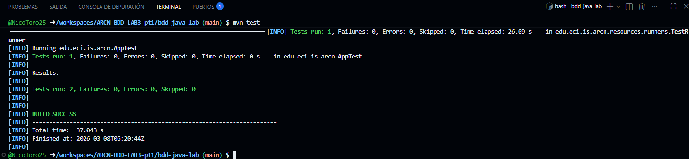
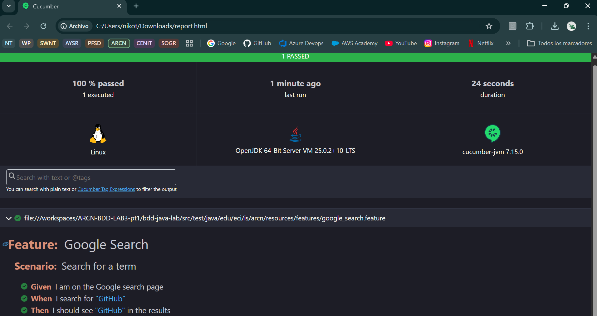

# Laboratorio BDD - Laboratorio #3

## Arquitectura Centrada en el Negocio (ARCN)

## Nicolás Toro Criollo

En este repositorio se busca solución el laboratorio propuesto en el link [TDD](https://eci-arcn.github.io/Labs/tdd/)
que tiene como objetivo que los estudiantes refactoricen código que viola los principios SOLID y apliquen las mejores prácticas.

Laboratorio de automatización aplicando **BDD (Behavior-Driven Development)** en Java con Cucumber, Selenium y Maven.

---

## Cómo ejecutar el proyecto

Ejecutar los comandos
```bash
cd bbd-java-lab
mvn test
```

Se generará un archivo en la carpeta "bdd-java-lab/target/HtmlReports" que se podrá descargar y el resultado de Cucumber

---

## Requisitos Previos
- Java 17+
- Maven
- GitHub Codespaces
- JUnit 5 para pruebas

---

## Estructura del proyecto

```bash
.
├── pom.xml
├── src
│   ├── main
│   │   └── java
│   │       └── edu
│   │           └── eci
│   │               └── is
│   │                   └── arcn
│   │                       └── App.java
│   └── test
│       └── java
│           └── edu
│               └── eci
│                   └── is
│                       └── arcn
│                           ├── AppTest.java
│                           └── resources
│                               ├── features
│                               │   └── google_search.feature
│                               ├── runners
│                               │   └── TestRunner.java
│                               └── steps
│                                   └── SearchSteps.java
└── target
    ├── classes
    │   └── edu
    │       └── eci
    │           └── is
    │               └── arcn
    │                   └── App.class
    ├── generated-sources
    │   └── annotations
    ├── generated-test-sources
    │   └── test-annotations
    ├── HtmlReports
    │   └── report.html
    ├── JSonReports
    │   └── report.json
    ├── JUnitReports
    │   └── report.xml
    ├── maven-status
    │   └── maven-compiler-plugin
    │       ├── compile
    │       │   └── default-compile
    │       │       ├── createdFiles.lst
    │       │       └── inputFiles.lst
    │       └── testCompile
    │           └── default-testCompile
    │               ├── createdFiles.lst
    │               └── inputFiles.lst
    ├── surefire-reports
    │   ├── edu.eci.is.arcn.AppTest.txt
    │   ├── edu.eci.is.arcn.resources.runners.TestRunner.txt
    │   ├── TEST-edu.eci.is.arcn.AppTest.xml
    │   ├── TEST-edu.eci.is.arcn.resources.runners.TestRunner.xml
    │   ├── TestRunner.txt
    │   └── TEST-TestRunner.xml
    └── test-classes
        └── edu
            └── eci
                └── is
                    └── arcn
                        ├── AppTest.class
                        └── resources
                            ├── runners
                            │   └── TestRunner.class
                            └── steps
                                └── SearchSteps.class
```

## Proceso realizado

1. Se definió el comportamiento esperado en un archivo **Feature** usando Gherkin:
	- Archivo: `bdd-java-lab/src/test/java/edu/eci/is/arcn/resources/features/google_search.feature`
	- Escenario implementado: búsqueda de un término en Google y validación de resultados.

2. Se implementaron los **Step Definitions** del escenario:
	- Archivo: `bdd-java-lab/src/test/java/edu/eci/is/arcn/resources/steps/SearchSteps.java`
	- Acciones realizadas:
	  - Inicialización de ChromeDriver con `WebDriverManager`.
	  - Ejecución en modo `headless` para facilitar pruebas en entornos sin interfaz gráfica.
	  - Navegación a Google, búsqueda del término y validación del contenido en la página.
	  - Cierre del navegador al finalizar cada escenario (`@After`).

3. Se configuró el **Runner de Cucumber** con JUnit:
	- Archivo: `bdd-java-lab/src/test/java/edu/eci/is/arcn/resources/runners/TestRunner.java`
	- Configuración aplicada:
	  - Ruta de features (`features`).
	  - Paquete de steps (`glue`).
	  - Plugins de reporte en formato `pretty`, `junit`, `json` y `html`.

4. Se gestionaron dependencias en Maven:
	- Archivo: `bdd-java-lab/pom.xml`
	- Dependencias principales:
	  - `cucumber-java`
	  - `cucumber-junit`
	  - `selenium-java`
	  - `webdrivermanager`
	  - `junit`

5. Se ejecutaron las pruebas con Maven:

```bash
cd bdd-java-lab
mvn test
```

## Resultados generados

Después de correr `mvn test`, se obtiene lo siguiente:



- `bdd-java-lab/target/HtmlReports/report.html`
- `bdd-java-lab/target/JSonReports/report.json`
- `bdd-java-lab/target/JUnitReports/report.xml`



